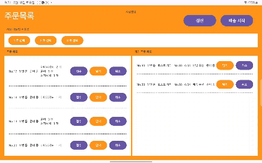
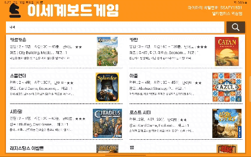
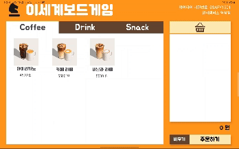
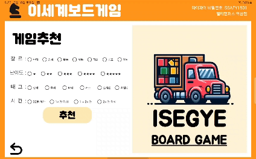
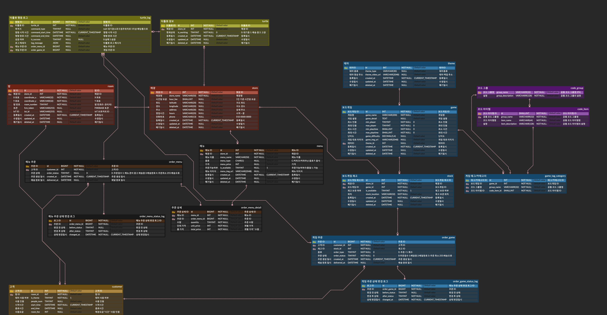
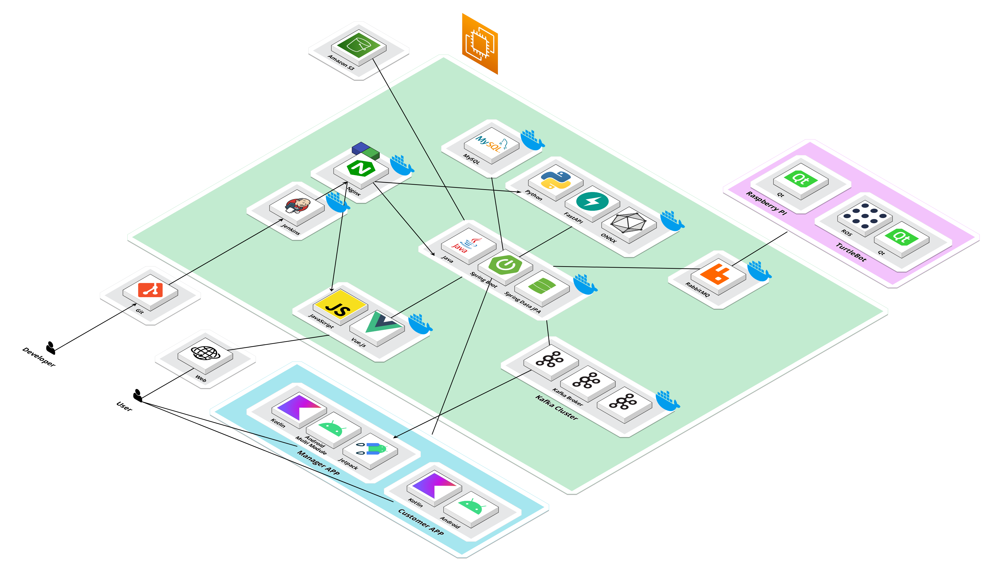
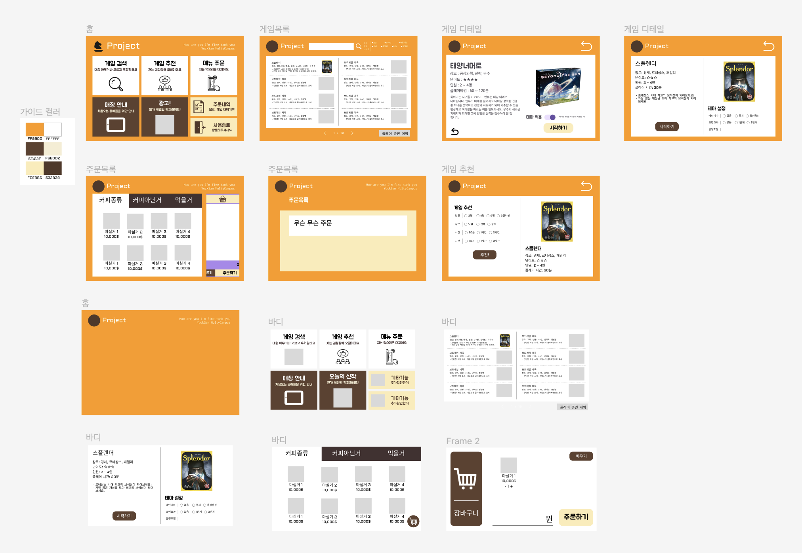

# 🎲 보드게임 자동 배송 프랜차이즈 서비스, 이세계 보드게임

## 🗂️ 목차

- [📌 서비스 소개](#-서비스-소개)
- [⏱ 개발 기간](#-개발-기간)
- [👥 팀 소개](#-팀-소개)
- [🛠️ 기술 스택](#️-기술-스택)
- [💡 주요 기능](#-주요-기능)
- [🌐 포팅 매뉴얼](#-포팅-매뉴얼)
- [💻 서비스 화면](#-서비스-화면)
- [📄 설계 문서](#-설계-문서)

## 📌 서비스 소개

### 자율 주행 로봇을 활용한 보드게임 및 음료 배송

- 자율 주행 로봇을 활용하여 고객이 주문한 보드게임 및 음료를 수령하여 고객에게 배송합니다.

### 스마트홈 기능을 이용한 보드게임별 테마(디스플레이, 사운드) 제공

- 스마트홈 기능을 이용하여 보드게임별 테마를 제공하여 게임 진행의 몰입감을 높입니다.

### 지점 위치와 해당 지점의 이용 가능 여부 확인

- 지점의 위치와 해당 지점의 사용 가능한 자리가 있는지 확인할 수 있습니다.

### 이미지 합성을 통한 기념사진 제공

- AI를 활용하여 고객의 사진을 게임 테마와 관련된 프레임과 합성하여 기념 사진을 제공합니다.

## ⏱ 개발 기간

- 2024.04.08 ~ 2024.05.17 (6주)

## 👥 팀 소개

<table align="center">
  <tr>
    <tr align="center">
        <td style="min-width: 250px;">
            <a href="https://github.com/moeun12">
              <b>박모은</b>
            </a> 
        </td>
        <td style="min-width: 250px;">
            <a href="https://github.com/TearofCoding">
              <b>김기찬</b>
            </a>
        </td>
        <td style="min-width: 250px;">
            <a href="https://github.com/ComelyU">
              <b>허준혁</b>
            </a>
        </td>
    </tr>
    <tr align="center">
        <td style="min-width: 250px;">
              
               Leader, Frontend 
        </td>
        <td style="min-width: 250px;">
              
               Backend, AI 
        </td>
        <td style="min-width: 250px;">
              
               Infra, Backend 
        </td>
    </tr>
  <tr>
    <tr align="center">
        <td style="min-width: 250px;">
            <a href="https://github.com/ODong-Dong">
              <b>오동현</b>
            </a>
        </td>
        <td style="min-width: 250px;">
            <a href="https://github.com/Riemanntotoro">
              <b>이상협</b>
            </a>
        </td>
        <td style="min-width: 250px;">
            <a href="https://github.com/cccl33">
              <b>최성규</b>
            </a>
        </td>
    </tr>
    <tr align="center">
        <td style="min-width: 250px;">
              
               Embedded 
        </td>
        <td style="min-width: 250px;">
              
               Embedded 
        </td>
        <td style="min-width: 250px;">
              
               Embedded 
        </td>
    </tr>
  </tr>
</table>

## 🛠️ 기술 스택

### 📱 Frontend

### 💻 Backend

### 🔮 AI

### 🤖 Embedded

### 🚀 Infrastructure

### ⚙️ Management Tools

### 🖥️ IDE

## 💡 주요 기능

### 1. 자율 주행 로봇을 활용한 보드게임 및 음료 배송

- ROS2를 사용한 터틀봇 주행 구현
- 터블봇의 장애물 회피 및 현재 위치 예측을 위한 LiDAR 센서, IMU 센서 사용
- SLAM 알고리즘을 활용한 맵 생성 및 로봇의 위치 파악
- Breshenham 알고리즘을 통한 맵 파일 제작
- A*, DWA, Follow the carrot 알고리즘을 활용한 전체 경로 생성
- PID 등을 활용한 로봇 제어

### 2. 스마트홈 기능을 이용한 보드게임별 테마(디스플레이, 사운드) 제공

- 임베디드 기기 간 통신을 위한 MQTT Protocol 사용

### 3. 지점 위치와 해당 지점의 이용 가능 여부 확인

- 지점의 위치 확인 가능
- 지점별 방 이용 가능 여부 확인 가능

### 4. 이미지 합성을 통한 기념사진 제공

- InsightFace의 inswapper_128.onnx 모델을 사용하여 이미지 합성

## 🌐 포팅 매뉴얼

[포팅 매뉴얼 보러가기](exec/Porting%20Manual.md)

## 💻 서비스 화면

### [점주용 앱]

- 음료메뉴, 게임배달, 게임회수 진행

### [고객용 앱]

- 보드게임검색 및 주문
- 테마 재생여부, 테마 음량 조절

- 음료 주문

- 보드게임 추천 기능

- 게임 플레이 후 기념사진 QR제공

### [웹]

- 고객용 앱, 점주용 앱 설치링크 QR제공
- 지점별 빈자리 확인

## 📄 설계 문서

### 1. ERD

### 2. 아키텍처

### 3. Mockup

### [4. API 명세서](https://comelyu.notion.site/API-3d35ecd2c3b04a288e13aca00cf9af6a?pvs=4)

